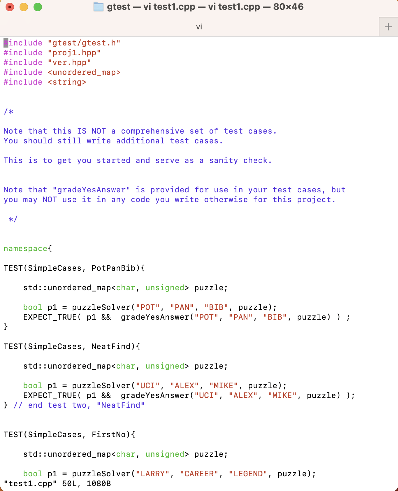
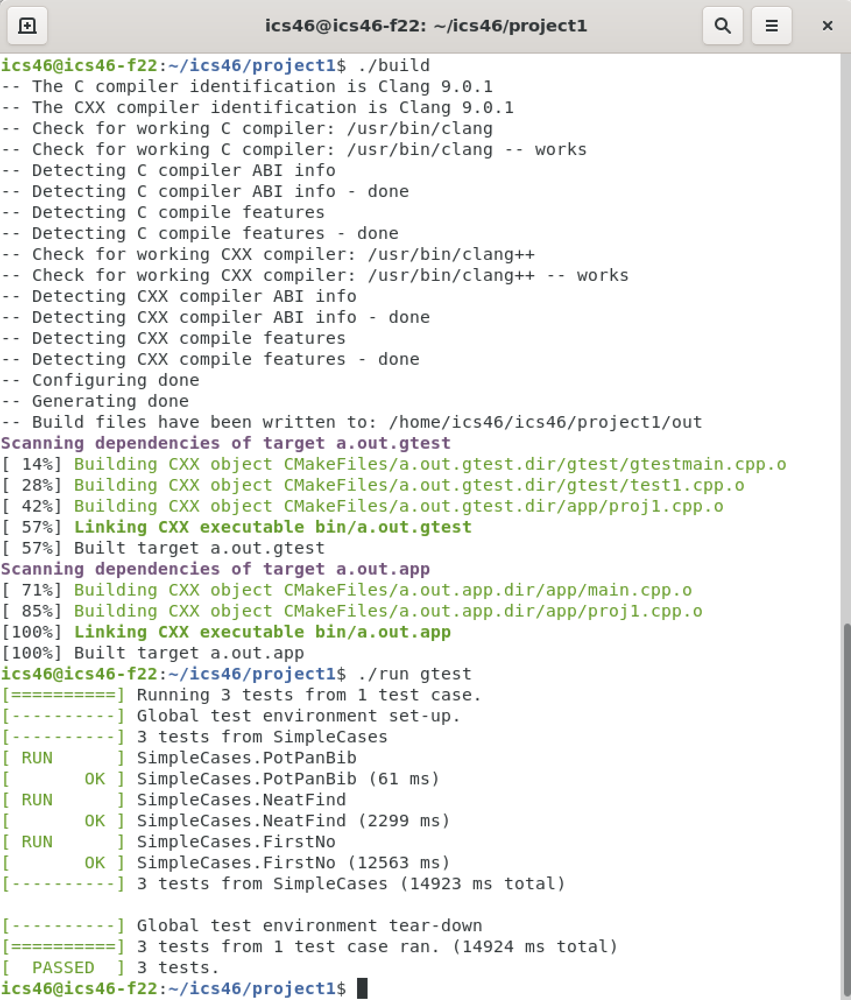

### Description:

This project is about writing the recursive function `solve(std::stack<char> letters, std::string s1, std::string s2, std::string s3, std::unordered_map<char, unsigned> & mapping)` that checking if the sum of the two words s1, s2 is equal to the third word or not. Each character in the strings does not have a digit yet, we have to map it with a digit and save it into the map. Each character has a unique digit. The solve function will be called recusively to do the digit assignment and verify the solution `s1 + s2 = s3`.

### Screenshots:

